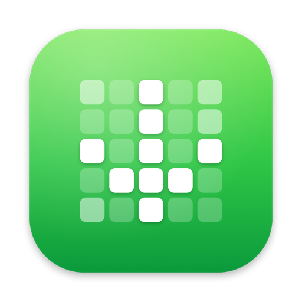
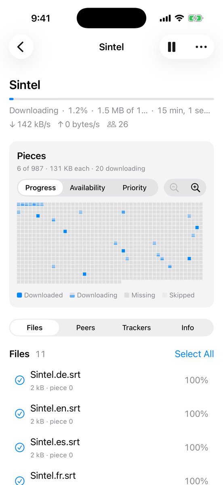
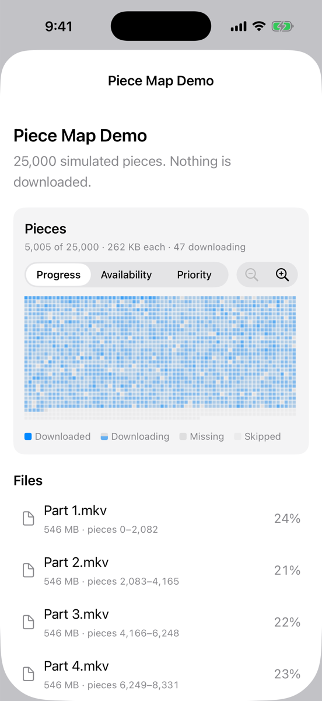
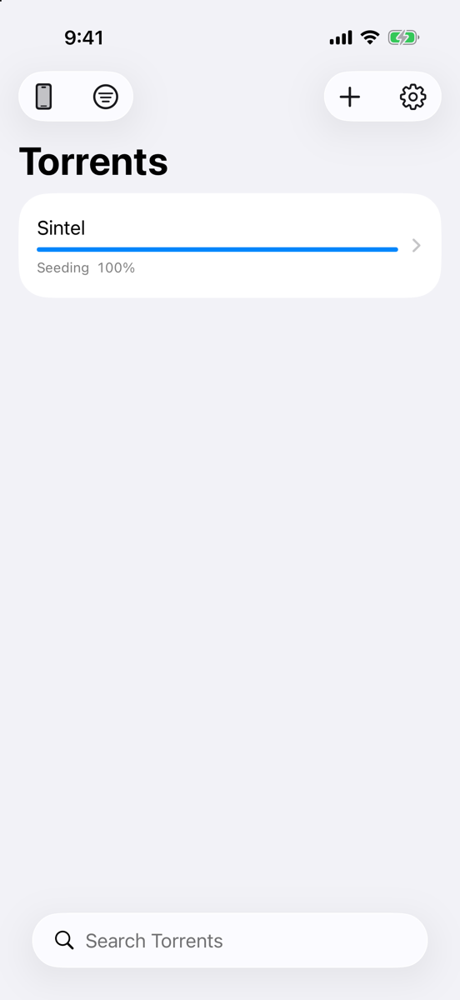
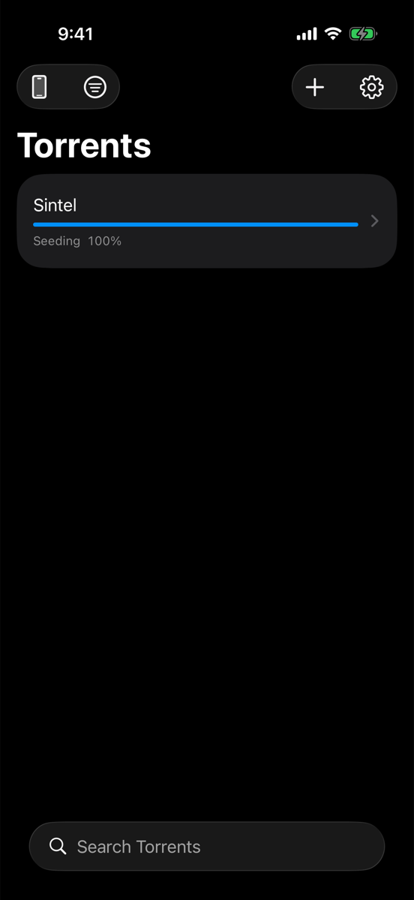

<p align="center">
  <i>🏛️ “Omnia mutantur, nihil interit.” 🏛️</i><br>
  <sub>All things change; nothing perishes. · Ovid, <i>Metamorphoses</i> XV.165</sub>
</p>

<p align="center">
  
</p>

<h1 align="center">🧩 Tessera</h1>

<p align="center">
  <b>The torrent client that looks like Apple made it. 🍏✨</b><br>
  See every piece. Choose what comes first. Watch it all from your iPhone. 🦜💚
</p>

<p align="center">
  
  
  
  
  
</p>

---

## 🤔 Why Tessera?

A *tessera* is one tile in a mosaic 🏛️. A torrent is a mosaic too: thousands of little pieces arriving from all over the world 🌍 and snapping together into your file. Most clients hide that behind a boring progress bar 😴. **Tessera puts the mosaic front and center.** 🎨

- 🧩 **See every single piece** land in real time
- 🎯 **Grab a range of pieces** with your finger and say *"these first!"*
- ▶️ **Start a video from the beginning** while the rest is still downloading
- 🍏 **Feels like it shipped with your Mac**: no Electron, no web views, no clutter
- 📱 **A real iPhone app**, with Live Activities and the Dynamic Island 🏝️

---

## 📸 Screenshots

<p align="center">
  
  &nbsp;
  
  &nbsp;
  
  &nbsp;
  
</p>

<p align="center"><sub>📱 Live piece map · 🧪 25,000-piece stress demo · ☀️ Light · 🌙 Dark</sub></p>

> 🖥️ Mac screenshots are on their way. The Mac app has a sidebar, a sortable table and an inspector with the same piece map.

---

## 🚀 Features

### 🧩 The Piece Map™ (okay, not actually trademarked)
- 🔥 **Live, animated grid** of every piece: downloaded, downloading, missing or skipped
- 👀 **Three lenses**: **Progress**, **Availability** (how many peers have each piece) and **Priority**
- 🔍 **Zoom** with buttons or pinch 🤏, and hover or tap any piece for details
- 📂 **Select a file** and its pieces light up on the map
- ⚡ **Buttery smooth with 25,000+ pieces**. We stress-tested it, so you don't have to

### 🎯 Priorities your way
- 🥇 **Four levels everywhere**: Highest, Normal, Lowest and Don't Download
- 🖐️ **Drag across the piece map** (Mac) or **touch, hold and drag** (iPhone) to pick an exact run of pieces, then set its priority
- 📑 **Multi-select files** and change them all at once
- 💾 **Remembered across restarts**

### ▶️ Download from Start
- 🎬 **One tap**: this file first, in order, from the very first byte
- ⏱️ **Smart deadlines** keep the front of the file and its last megabyte urgent, so one slow peer can't hold you up
- 📊 **"Ready up to" bar** shows exactly how much is playable
- 👆 **Open it early**: Quick Look on iPhone or your default app on Mac, once the start and the end have arrived
- 🧪 In testing, a partial MP4 started playing at **14–29% downloaded** 🤯

### 🖥️ A Mac app that belongs on a Mac
- 🗂️ **Sidebar** with All, Downloading, Seeding, Completed and Paused, each with live counts
- 📋 **Sortable table**, native right-click menus, ⌘ shortcuts for everything
- 🔎 **Inspector** with the piece map, Files, Peers, Trackers and Info
- 🖱️ **Drag and drop** `.torrent` files, magnet links, and "Open With" from Finder
- 🛎️ **Dock progress** with a badge, **notifications** when downloads finish, and an optional **menu bar** item
- 📁 Downloads land in **~/Tessera** by default, or any folder you like

### 📱 An iPhone app that's actually an app
- 🏝️ **Live Activity and Dynamic Island** for active downloads
- 📤 **Share Sheet extension**: send torrents and magnets from Safari, Files or Messages
- 🗃️ Downloads show up in the **Files app** under On My iPhone › Tessera
- 🌗 **iPad layout**, light and dark mode, and a Keep Screen Awake option for long downloads

### 🛰️ Remote control (beta)
- 🔗 **Control your Mac from your iPhone**: Tessera finds it on your network automatically
- 🔢 **Pair once** by matching a code on both screens
- 🔐 **Everything after pairing is encrypted**
- 🪄 Same UI, same piece map, same priorities, just driving the Mac 🚗

### 🛡️ Built to not lose your stuff
- 💾 Progress saved **every 30 seconds**, on pause, on finish and on quit
- 🔁 **Restart, crash or reinstall**: your torrents come back where they left off
- ✅ **42 automated tests**, covering offline seed-to-download, restarts, priorities, remote control and the piece map

---

## 🥊 How it compares

| | 🧩 **Tessera** | Transmission | qBittorrent |
|---|:---:|:---:|:---:|
| 🍏 Native Mac app | ✅ SwiftUI | ✅ AppKit | ➖ Qt |
| 📱 Native iPhone and iPad app | ✅ | ❌ | ❌ |
| 🏝️ Live Activity and Dynamic Island | ✅ | ❌ | ❌ |
| 🧩 Piece map | ✅ Zoomable, 3 views | ➖ Basic grid | ➖ Progress bar |
| 🎯 Priority for a range of pieces you pick | ✅ Drag on the map | ❌ | ❌ |
| 📂 Per-file priority | ✅ | ✅ | ✅ |
| ▶️ One file first, from the start | ✅ With deadlines | ➖ Whole torrent | ➖ Whole torrent |
| 🛰️ Control your Mac from your iPhone | ✅ Paired and encrypted | ➖ Web UI | ➖ Web UI |
| ⌚ Apple Watch | 🔜 | ❌ | ❌ |
| 🪟 Windows and Linux | ❌ Apple only, proudly 😎 | ✅ | ✅ |
| ⚙️ Engine | libtorrent 2.1 | Transmission's own | libtorrent |

<sub>✅ yes · ➖ partly or another way · ❌ no · 🔜 coming soon. Competitor columns describe their stable releases as we understand them. Spotted a mistake? Open an issue. 🙏</sub>

---

## 🔮 Coming soon

- ⌚ **Apple Watch app**: progress rings, pause and resume from your wrist, plus a complication
- 🍿 **Play while downloading**: a built-in player that jumps the download to wherever you scrub
- 🗣️ **Shortcuts and Siri**: "Add magnet", "Pause all", "What's downloading?"
- 🧱 **Home Screen and Lock Screen widgets**, plus a Control Center toggle
- ☁️ **iCloud sync** of your torrent list and settings across devices
- 🛡️ **VPN binding** with a kill switch, plus an optional IP blocklist
- 🔋 **Smart pausing** on cellular or in Low Power Mode
- 🏷️ **Labels** with a save folder for each one
- 🌱 **Seeding goals**: stop at a set ratio or time
- 🐢 **Speed schedule** and a one-tap slow mode
- 📥 **Watch folder** on Mac for automatic adding
- 🚚 **Move downloads** to another folder or drive without downloading again
- 📰 **RSS feeds** with filters
- 🛠️ **Create torrents** from any file or folder
- 🌐 **Remote access** from outside your home network

---

## 🛠️ Build it yourself

**You need:** a Mac with Xcode 27, Homebrew and about 15 minutes for the first build ☕.

```sh
brew install xcodegen cmake
Scripts/build-libtorrent.sh      # builds libtorrent, Boost and OpenSSL for Mac and iOS (cached afterwards)
xcodegen generate                # creates Tessera.xcodeproj from project.yml
open Tessera.xcodeproj
```

Then pick a scheme and hit ▶️:

| Scheme | What it is |
|---|---|
| 🖥️ `Tessera-macOS` | The Mac app (Apple silicon and Intel) |
| 📱 `Tessera-iOS` | The iPhone and iPad app, with the Share extension and widgets |
| ⚙️ `TesseraKit` | The engine framework and its tests |
| 🧪 `tesseractl` | A command-line tool for trying the engine on real torrents |

### 🗺️ Project layout

```
Apps/            🖥️📱 Mac and iPhone app code
Shared/          🤝 Code both apps use, including remote control
TesseraKit/      ⚙️ Objective-C++ wrapper around libtorrent, with a Swift API
Packages/TesseraUI/  🧩 The piece map and other shared SwiftUI views
Extensions/      📤 Share extension and Live Activity widgets
Tools/tesseractl/    🧪 Command-line engine harness
Scripts/         🏗️ Native dependency build script
```

The full build plan and progress live in [PHASES.md](PHASES.md) 📒.

---

## ⚖️ Use it responsibly

Tessera is a tool for sharing files over BitTorrent 🌐. Please only download and share content you have the right to, like Linux ISOs 🐧, open movies such as Sintel 🎬, and your own files.

---

<p align="center">Made with 💚, SwiftUI and an unreasonable love of tiny squares 🟩🟩🟩</p>
